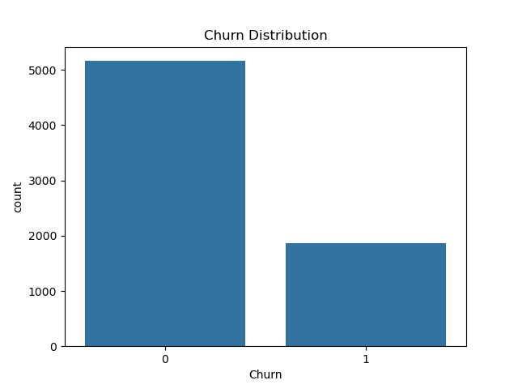
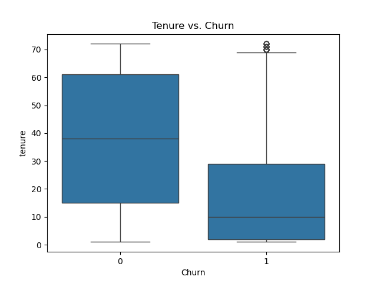
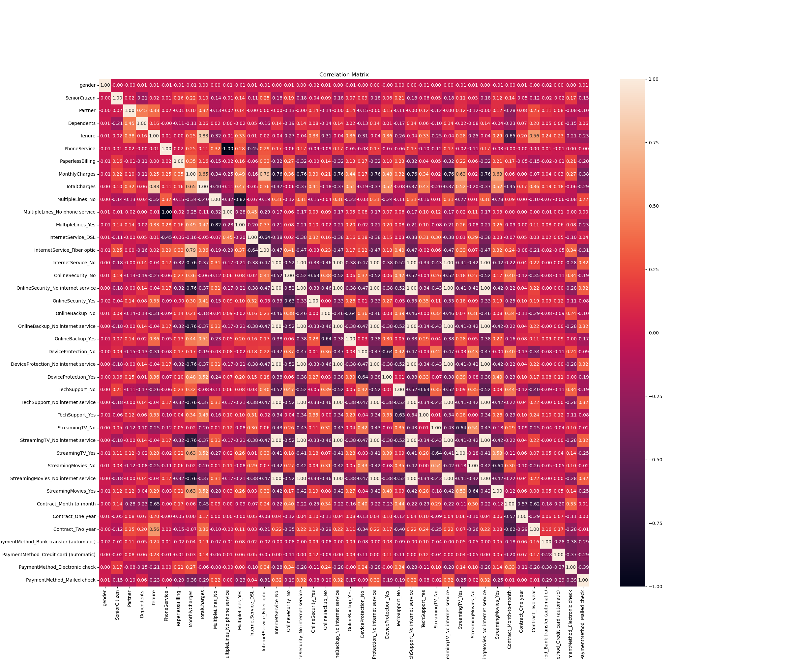
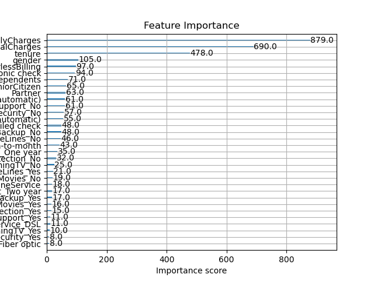
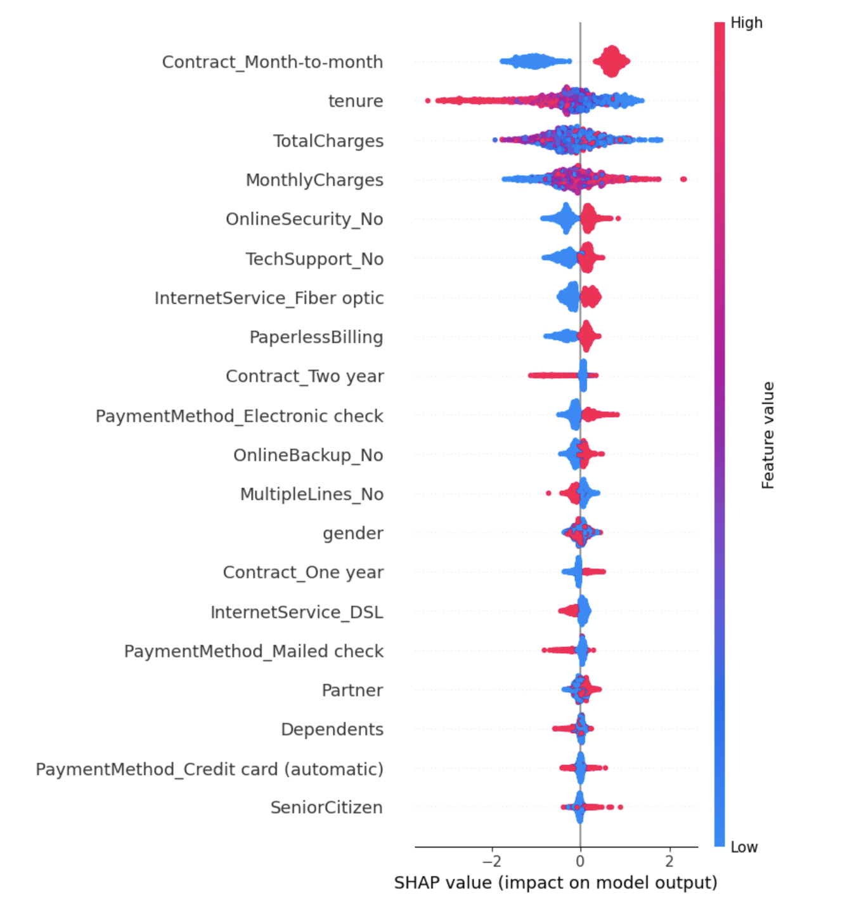

#  Customer Churn Prediction – Python Project

**Author**: Houcine El  
**Project Type**: Machine Learning & Data Analysis  
**Presentation**: 🎥 [Watch the Video](#) *(Link will go here)*

---

##  Project Overview

In this project, I explored customer churn using a Telco dataset. I built a full machine learning pipeline using Python, focusing on data cleaning, exploratory analysis, modeling with XGBoost, and explainability using SHAP.

---

## Code

You can view the full Python code here:  
**[churn_analysis.ipynb](churn_analysis.ipynb)** 

---

##  Key Insights

###  Churn Distribution
Only 27% of customers in the dataset churned, while 73% stayed.

---

###  Tenure vs. Churn
Churned customers had a median tenure of 10 months, while retained ones averaged 40 months.

---

###  Correlation Matrix
Churn is negatively correlated with tenure and total charges, and positively correlated with monthly charges.

---

###  Feature Importance (XGBoost)
XGBoost ranked MonthlyCharges, TotalCharges, and Tenure as the most important features

---

###  SHAP Summary Plot
SHAP values show that short tenure, month-to-month contracts, and high monthly charges consistently increase churn probability.

---

##  Business Recommendations

Three key recommendations based on model insights and visuals to help reduce customer churn:

1. Encourage Long-Term Contracts:
   - Month-to-month contracts were a top predictor of churn based on the SHAP summary plot and feature importance graph.
   - The company should offer incentives, like discounts or perks, for switching to 1- or 2-year plans.

2. Strengthen Onboarding for New Customers:
   - The "Tenure vs. Churn" boxplot shows that most churners were customers with less than one year of service, and tenure is a key churn 
    driver.
   - A structured onboarding strategy with tailored support could help reduce early churn.

3. Promote Add-On Services:
   - The SHAP summary plot shows that not having tech support or online security is linked to churn.
   - These services likely increase customer satisfaction and engagement. Offering free trials or bundling them in plans could help reduce 
    churn.
   
   ---

##  Model & Tools Used

- **Model**: XGBoost Classifier  
- **Explainability**: SHAP  
- **Metrics**: Accuracy  
- **Tools & Libraries Used**: `pandas`, `numpy`, `seaborn`, `matplotlib`, `scikit-learn`, `xgboost`, `shap`
 
