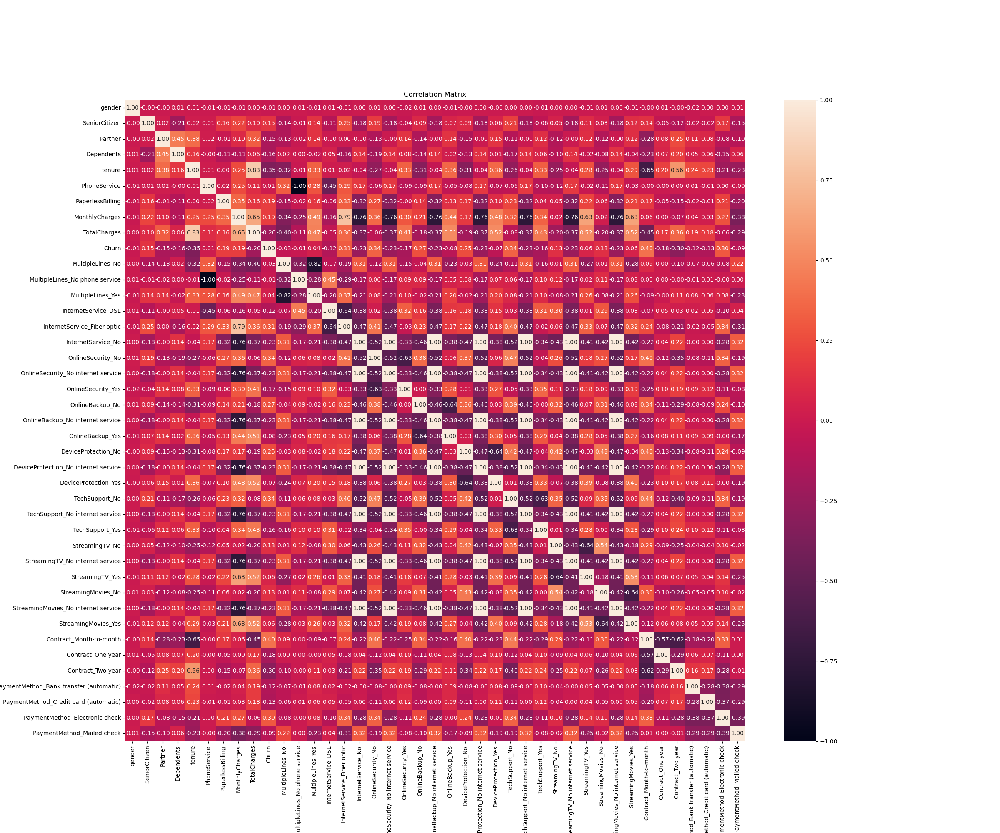
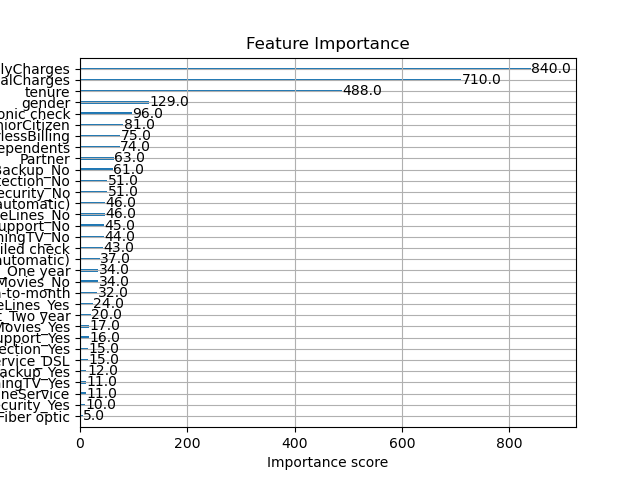

# 📊 Customer Churn Prediction – Python Project

**Author**: Houcine E  
**Project Type**: Machine Learning & Data Analysis  
**Presentation**: 🎥 [Watch the Video](#) *(Link will go here)*

---

## 🔍 Project Overview

This project explores customer churn using a Telco dataset. We build an end-to-end machine learning pipeline using Python, focusing on preprocessing, exploratory data analysis, XGBoost modeling, and SHAP explainability.

---

## 📁 Project Structure


---

## 🧠 Key Insights

### 🔸 Churn Distribution
The churn dataset is imbalanced with ~27% churners.


---

### 🔸 Tenure vs. Churn
Customers with low tenure (under 12 months) are more likely to churn.


---

### 🔸 Correlation Matrix
Tenure is highly correlated with TotalCharges. Churn is positively correlated with MonthlyCharges and negatively with Tenure.



---

### 🔸 Feature Importance (XGBoost)
Top predictors: MonthlyCharges, TotalCharges, Tenure, Contract type.



---

### 🔸 SHAP Summary Plot
High churn risk comes from short tenure, month-to-month contract, and high charges.


---

## ⚙️ Model & Tools Used

- **Model**: XGBoost Classifier  
- **Explainability**: SHAP  
- **Metrics**: Accuracy (with class imbalance awareness)  
- **Tech Stack**: `pandas`, `numpy`, `seaborn`, `matplotlib`, `scikit-learn`, `xgboost`, `shap`

---

## 💼 Business Recommendations (Short & Actionable)

- 🔁 Encourage long-term contracts to reduce churn
- 🚀 Improve onboarding for new customers (< 90 days)
- 💸 Offer bundles or discounts for high-paying customers
- 🛡️ Promote add-ons like online security & tech support
- 🧾 Push for automatic payments over manual e-checks
- 📢 Use the model to identify and retain high-risk customers
- 👥 Support seniors & single customers with tailored service
- 🔍 Continuously retrain the model and track strategy outcomes

---

## 📦 Installation

Install required libraries with:

```bash
pip install -r requirements.txt

